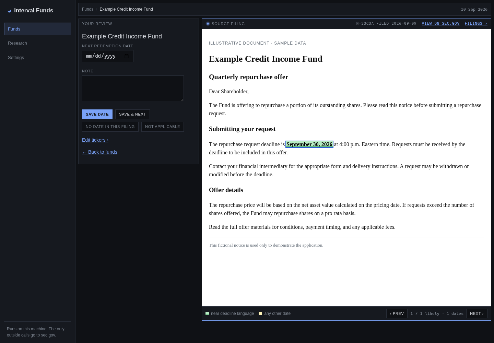
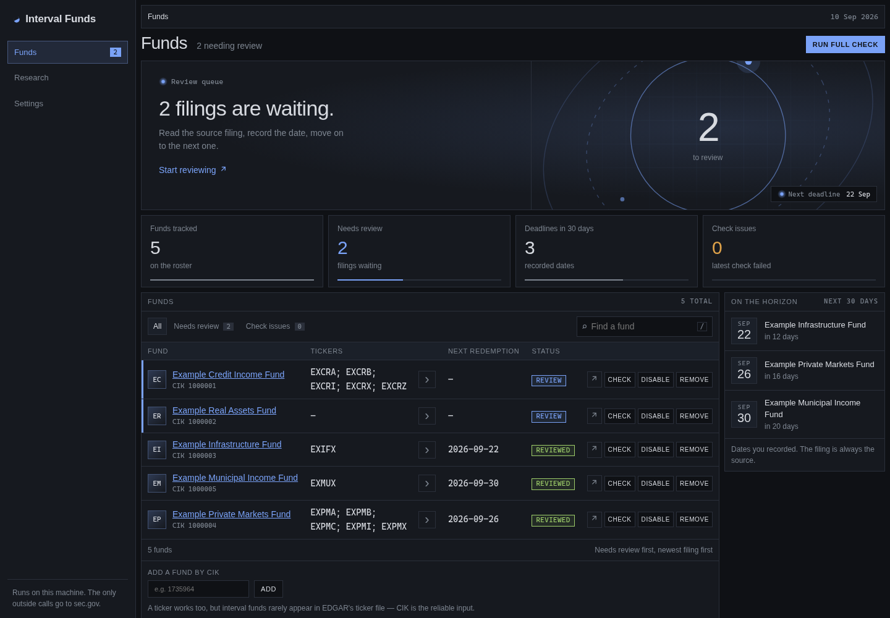
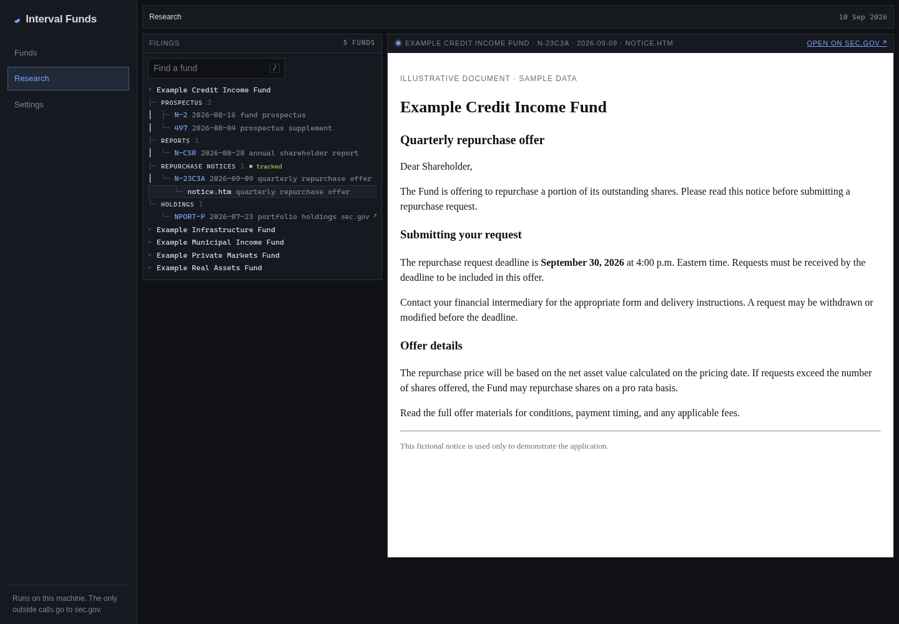

# Interval Fund Viewer

Track interval fund redemption deadlines from SEC EDGAR filings. Read the
source document, record the date, and keep a local CSV up to date.

Runs on your computer with Python’s standard library and a browser. No API key
or extra Python packages required.



*All screenshots use fictional funds and sample documents.*

## Quick start

Requires **Python 3.10+**. Download or clone this repository, then run:

```sh
python app.py
```

On Windows, you can also double-click `run.bat`. The app opens at
<http://127.0.0.1:8765/> (or the next available port).

Open **Settings**, enter a SEC contact string such as
`Your Name you@example.com`, and click **Test connection**.

## Workflow

1. **Add funds by CIK.** Tickers work when available in EDGAR’s ticker lookup.
2. **Run a full check.** New N-23C3 and SC TO filings appear in the review queue.
3. **Read and record.** Green highlights mark dates near deadline language;
   yellow marks other dates. Verify the date in context, then save it or mark
   the filing as having no date or not applicable. **Save & next** advances
   through the queue.
4. **Use the CSV.** `redemptions.csv` updates when funds, tickers, or recorded
   dates change. Review history stays in the app.



## Research

Browse a tracked fund’s filings by category and open documents alongside the
tree. PDFs and other non-HTML primary documents link to sec.gov. Edit a fund’s
tickers using the **›** beside its symbols.



## Your data

Files are stored beside the app and excluded from Git:

| File | Contents |
| --- | --- |
| `funds.db` | Funds, settings, saved dates, and review/ticker history |
| `redemptions.csv` | Current fund names, tickers, and dates |
| `redemptions-YYYY-MM-DD.csv` | Daily snapshots when the CSV changes |
| `cache/` | Downloaded documents and filing lists |

Back up `funds.db`. The cache can be deleted and is not automatically pruned.
An optional `redemptions-seed.csv` can populate an empty database; it needs a
`cik` column. The regular export is not a seed file.

If Excel blocks an export, close the CSV and reload the fund list. For a proxy,
set `HTTPS_PROXY`; if it intercepts TLS, also set `SSL_CERT_FILE` to its root
certificate before starting.

## Tests

```sh
python -m unittest discover -s tests -v
```

Tests use local fixtures and do not contact SEC EDGAR.
